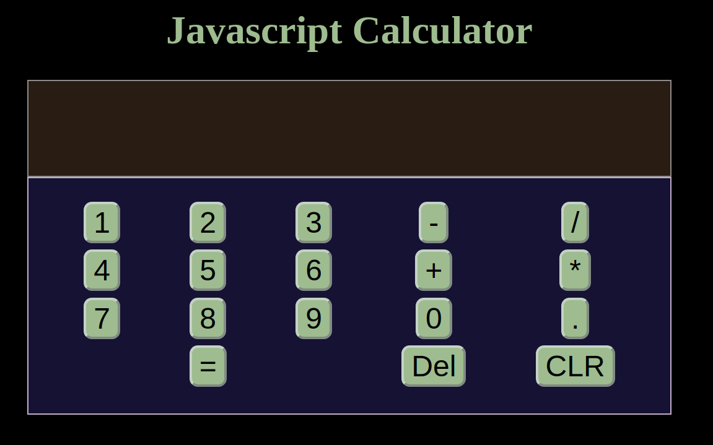

# Calculator

### This is JS Calculator that follows the correct mathematical order of operatotion rules

> 

## Built With

- HTML 5
- CSS 3

## Live Demo

[Live Demo Link](https://ikraamg.github.io/Calculator/)

## Getting Started

To get a local copy up and running follow these simple example steps:

### Prerequisites

A browser of your choice, preferrably Chrome

### Setup

- Fork/Clone this project to your local machine
- Open index.html in your browser

## Authors

👤 **Ikraam Ghoor**

- Github: [@ikraamg](https://github.com/ikraamg)
- Twitter: [@GhoorIkraam](https://twitter.com/GhoorIkraam)
- Linkedin: [isghoor](https://linkedin.com/isghoor)

## 🤝 Contributing

Contributions, issues and feature requests are welcome!

Feel free to check the [issues page](https://github.com/ikraamg/Calculator/issues)

## Show your support

Give a ⭐️ if you like this project!

## Acknowledgments

- The Odin project for the project plan
- sanitize.css creators for the opinionated css reset file

## 📝 License

This project is [MIT](LICENSE.md) licensed
